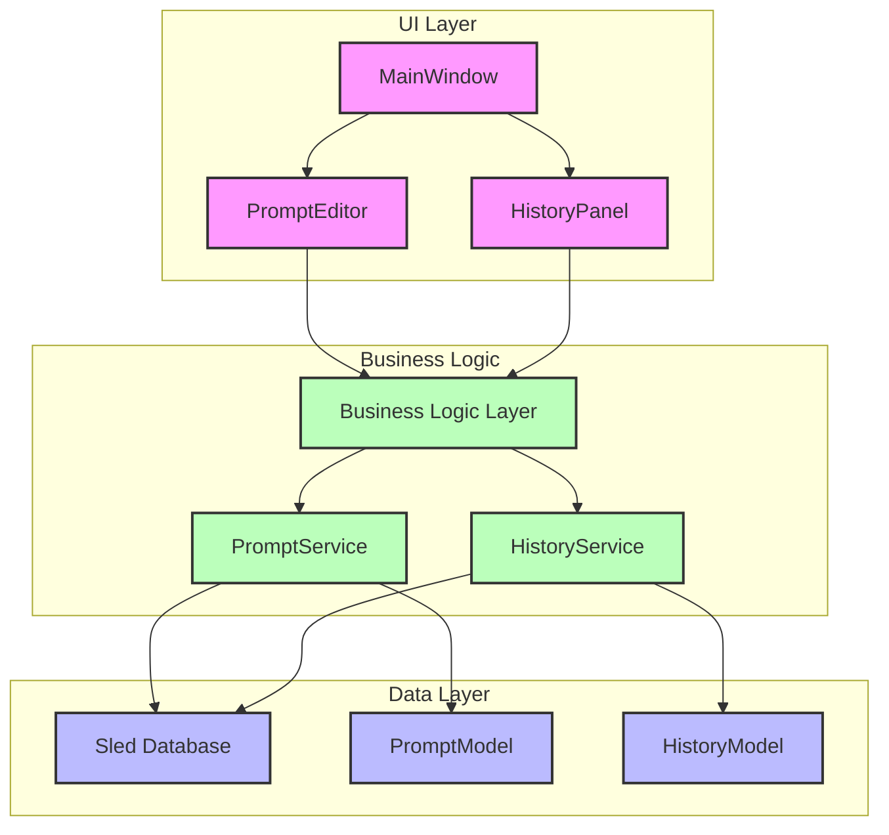
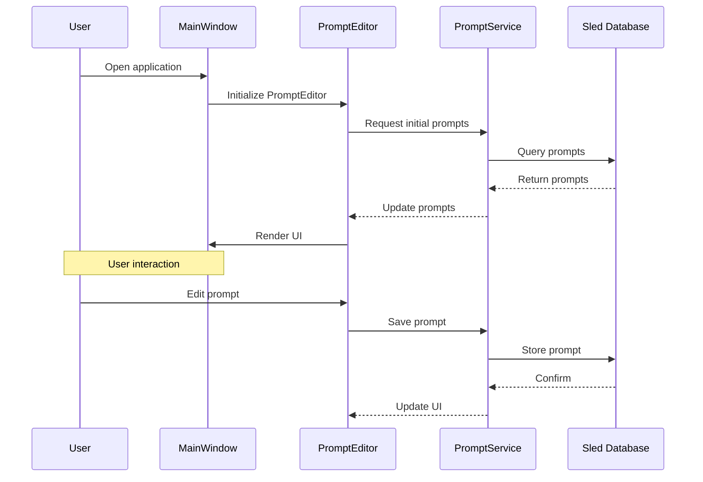

# PromptManager

A modern desktop application for managing and executing prompts, built with Rust and SLint.

## Architecture Overview

### 1. System Architecture



### 2. Component Relationships

#### UI Components
- **MainWindow**
  - Main entry point of the application
  - Manages the overall layout and state
  - Coordinates between PromptEditor and HistoryPanel

- **PromptEditor**
  - Handles prompt creation and editing
  - Manages prompt validation
  - Interfaces with PromptService for data operations

- **HistoryPanel**
  - Displays execution history
  - Provides filtering and search capabilities
  - Interacts with HistoryService for data retrieval

#### Business Logic
- **PromptService**
  - Manages prompt lifecycle
  - Handles prompt validation and execution
  - Interfaces with database for persistence

- **HistoryService**
  - Manages execution history
  - Provides filtering and querying capabilities
  - Handles data persistence

#### Data Models
- **PromptModel**
  - Represents a prompt with metadata
  - Includes validation rules
  - Handles serialization/deserialization

- **HistoryModel**
  - Stores execution history
  - Tracks execution status and results
  - Provides query capabilities

### 3. Data Flow



### 4. Key Technical Choices

#### UI Framework
- **SLint**: Chosen for its modern declarative approach and native performance
- Benefits:
  - Type-safe UI definition
  - Reactive programming model
  - Cross-platform support
  - Native performance without JavaScript overhead

#### Data Storage
- **Sled**: Selected for its:
  - Embedded nature (no external dependencies)
  - ACID compliance
  - Performance characteristics
  - Rust-native implementation

#### Async Runtime
- **Tokio**: Provides:
  - Robust async runtime
  - Easy-to-use async/await syntax
  - Built-in networking capabilities
  - Good community support

### 3. Project Structure

```
src/
├── components/          # UI components
│   ├── main_window.rs   # Main application window
│   ├── prompt_editor.rs # Prompt editing interface
│   └── history_panel.rs # History display
├── models/             # Data models
└── services/           # Business logic
```

### 4. Maintenance Information

#### Dependencies
- **Critical Dependencies**:
  - `slint`: UI framework
  - `sled`: Database
  - `tokio`: Async runtime
  - `serde`: Serialization

- **Version Management**:
  - All dependencies are pinned in `Cargo.toml`
  - Regular updates recommended for security patches

#### Build Process
- Uses Rust's standard build system
- Custom build script (`build.rs`) for SLint integration
- Requires Rust toolchain and cargo

#### Testing Strategy
- Unit tests for business logic
- Integration tests for component interactions
- Manual testing for UI flows

#### Error Handling
- Uses `anyhow` for error propagation
- Structured error types for different domains
- Comprehensive logging with `tracing`

### 5. Development Guidelines

1. **Code Style**
   - Follow Rust's standard formatting (`cargo fmt`)
   - Use async/await for all I/O operations
   - Keep UI logic separate from business logic

2. **Performance Considerations**
   - Use async operations for all I/O
   - Implement proper error handling
   - Follow SLint's best practices for UI updates

3. **Security**
   - Regular dependency updates
   - Input validation for all user inputs
   - Proper error handling to prevent crashes

### 6. Getting Started

1. Prerequisites:
   - Rust toolchain installed
   - Cargo package manager

2. Building:
   ```bash
   cargo build
   ```

3. Running:
   ```bash
   cargo run
   ```

### 7. Contributing

1. Create a new branch for your feature
2. Implement your changes
3. Add tests if applicable
4. Update documentation if needed
5. Submit a pull request

### 8. License

[Insert license information here]

---

For more detailed information about specific components or architectural decisions, please refer to the documentation in the `docs` directory.
